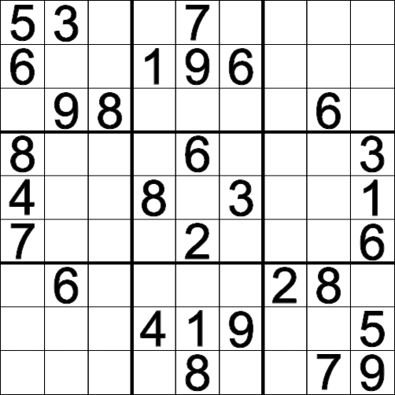

<div align="center">
  
  <h1>react-ppi-sudoku</h1>
  <h6>An out of the box ready for use react sudoku canvas-built component</h6>
</div>
<br>

## About
*PPI Sudoku* is a plug and play highly customizable sudoku react component.  
By default you play with mouse and keyboard, but you can customize it's input behaviour the way you like it. For example, it isn't fully compatible with mobile input system, so we provide a `MobileKeyboard` component to feed inputs to the canvas.

You can (and should) control the game's start and end events with external buttons and components. It's also possible to export images from the sudoku canvas, which should be controlled externally.

#### What it lacks?
This package started as a school project, so it lacks some (more complex) functionalities which we didn't accounted for when developing it. These include:
- Not being able to generate random or custom boards (there are only 3 hard-coded board presets currently).
- Not being able to automatically solve the board.
- No number hints.
- Not fully translated to english.
- You can theoretically change the board size (9x9), but you can't input numbers larger than 9 so it becomes kinda unplayable.

It also has bugs, lot's of them 😅

These features are on their way to being implemented, this package is still in it's early releases so please be patient.

<br>

## Installation
You can install it with **npm**.
`npm install react-ppi-sudoku`

You can also use the raw javascript version by importing the script. 

<br>

## Usage
I'm currently working on a simpler way to translate it to React, but for the time this is how you implement it.


```js
import React, { useRef, useState, useEffect } from 'react';
import Sudoku from 'react-ppi-sudoku';

const App = () => {
  const canvas = useRef();
  const [sudoku, setSudoku] = useState();
  const [result, setResult] = useState();

  useEffect(() => {
    setSudoku(new Sudoku(canvas.current));
  }, []);

  const handlePlay = () => {
    sudoku.criarNovoJogo();
  };

  const handleStop = () => {
    const result = sudoku.finishGame();
    setResult(result);
  };

  return (
    <>
      <canvas ref={canvas} />
      <div>
        <button onClick={handlePlay}>Play</button>
        <button onClick={handleStop}>Stop</button>
      </div>
      {result && (
        <p>
          You got {result.acertos} right and {result.erros} wrong!
        </p>
      )}
    </>
  );
};
```
The `Sudoku` class needs a reference of a canvas component, but the reference isn't set until the content is loaded, so we use `useEffect` to make sure it's loaded.

After that you can use all `Sudoku` class functionallities with, for example, buttons to start and finish the game. To start a game use `criarNovoJogo` and to finish it use `finishGame` which will return an object with `acertos` (rights) and `errors` (wrongs).

**Please be wary with React Strict Mode, it will create multiple instances of the game if implemented this way**

<br><br>

## A Classe *Sudoku*
A classe Sudoku é a classe principal, que é responsável pelo jogo inteiro, desde gerar o tabuleiro, até desenhar no canvas.  
A seguir será mostrado alguns elementos importantes para a manipulação desta classe.

|Variáveis|Valor|Descrição|
|:---|:---|:---|
|`BACKGROUND_COLOR`|String com valor hexadecimal para cor. <br> Ex: `#F00`, `red`, `#11FF22`|Altera a cor de plano de fundo.
|`SELECTED_COLOR`|String com valor hexadecimal para cor.|Altera a cor da célula selecionada.
|`FONT_COLOR`|String com valor hexadecimal para cor.|Altera a cor da fonte.
|`FONT_FAMILY`|String com nome de uma fonte. <br> Ex: `Arial`, `Consolas`|Altera a fonte utilizada.
|`FONT_SIZE`|String com um tamanho. <br> Ex: `16px`, `2.5em`|Altera o tamanho da fonte.
|`GRID_COLOR`|String com valor hexadecimal para cor.|Altera a cor da grade.
|`RIGHT_COLOR`|String com valor hexadecimal para cor.|Altera a cor para números corretos.
|`WRONG_COLOR`|String com valor hexadecimal para cor.|Altera a cor para números incorretos.
|`continuousCheck`|Valor booleano. <br> Default: `False`|Determina se o jogo deve checar continuamente a validade de cada número inserido.

<h1></h1>
<br>

|Funções|Parâmetros|Retorno|Descrição|
|:---|:---:|:---:|:---|
|`criarNovoJogo`| --- | --- | Inicia uma nova partida com um novo tabuleiro (dentre 3 pré-definidos). <br> Cuidado pois apaga o progresso da partida atual.
|`finishGame`| --- | Um objeto  `{erros: X, acertos: Y}` aonde `X` e `Y` são os respectivos valores.| Termina a partida atual.
|`exportAsImage`| --- | Uma String contendo uma imagem png em base 64 | Retorna uma imagem do estado atual do tabuleiro. Utilize isso para "tirar uma foto" do tabuleiro.
|`resizeCanvas`| `new_size: int` | --- | Use essa função para alterar o tamanho do objeto.
|`generateTestBoard`| --- | --- | Preenche o tabuleiro com um jogo e solução padrão. Use para testes.
|`drawBoard`| --- | --- | Desenha o tabuleiro.
|`select`|`x: int` <br> `y: int`| --- | Seleciona um o quadrado na posição `X` e `Y` no tabuleiro.
|`unselect`| --- | --- | Desmarca o quadrado selecionado no tabuleiro.
|`inputNumber`| `n: int` <br> 1 até 9 | --- | Escreve o número `N` no quadrado previamente selecionado.

<br><br>

---

## RAW JAVASCRIPT IMPLEMENTATION
Primeiro importe o script para o seu projeto:  
`<script type="text/javascript" src="https://tiagocf2.github.io/PPI-Sudoku/sudoku-canvas.js"></script>`    
Ou [baixe o arquivo JavaScript aqui](https://raw.githubusercontent.com/Tiagocf2/PPI-Sudoku/master/docs/sudoku-canvas.js).  
<br>
Note que é preciso ter um elemento **Canvas** no HTML para executar o Sudoku.  
Depois disso é só criar uma instância da classe **Sudoku** e passar o canvas como referência.  
`let su = new Sudoku(canvas, tamanho);`  
`canvas` - é a referência ao elemento HTML canvas, onde o Sudoku será executado.  
`tamanho` - é um atributo opcional que define o tamanho do canvas. Por padrão é **500**.  
<br>
Agora é possível selecionar um quadrado com o `mouse` ou com as `setas` do teclado.  
Com o quadrado selecionado é possível inserir números de `1 à 9` apertando as respectivas teclas.  
Para remover um número utilize a tecla `Backspace`.

## Exemplo de Implementação
```
<!DOCTYPE html>
<html lang="pt-br">
  <head>
    <title> Sudoku Game </title>
  </head>
  
  <body>
    <h1> Sudoku! </h1>
    <canvas id="sudoku"></canvas>
    <button onclick="finishGame()"> Finish </button>
    <button onclick="exportBoard()"> Export </button>
  </body>
  
  <script type="text/javascript" src="https://tiagocf2.github.io/PPI-Sudoku/sudoku-canvas.js" defer></script>
  <script type="text/javascript">
    let canvas = document.getElementById("sudoku");
    let sudoku = new Sudoku(canvas);
    
    function finishGame(){
      result = sudoku.finishGame();
      alert(`Game Over\nScore: ${result.acertos / sudoku.boardSize ** 2 * 100}%`);
    }
    
    function exportBoard(){
      let img = sudoku.exportAsImage();
      let download = document.createElement('a');
      download.href = img;
      download.download = "meu_sudoku.png";
      download.click();
    }
  </script>
  
</html>
```
<br>

**Em dispositivos móveis não é possível inserir os números, então é preciso circunver isso adicionando botões, que então insiram os números no quadrado selecionado, utilize a função `inputNumber` do Sudoku. Isso acontece pois dispositivos móveis só abrem o teclado quando é selecionado um elemento de input. Veja o site do projeto por um dispositivo móvel como exemplo.**
 

---
  <center>
  
  [](https://tiagocf2.github.io/PPI-Sudoku/)

  <h6 color="#bbb">
    <i>Desenvolvido por Nikolle de Lacerda Nascimento e Tiago Civatti Frausino</i>
  </h6>
  <h6 color="#bbb"> 
    Projeto 1 <br> 
    Programação para Internet I <br>  
    TSIV4A - IFB 
  </h6>
</center>